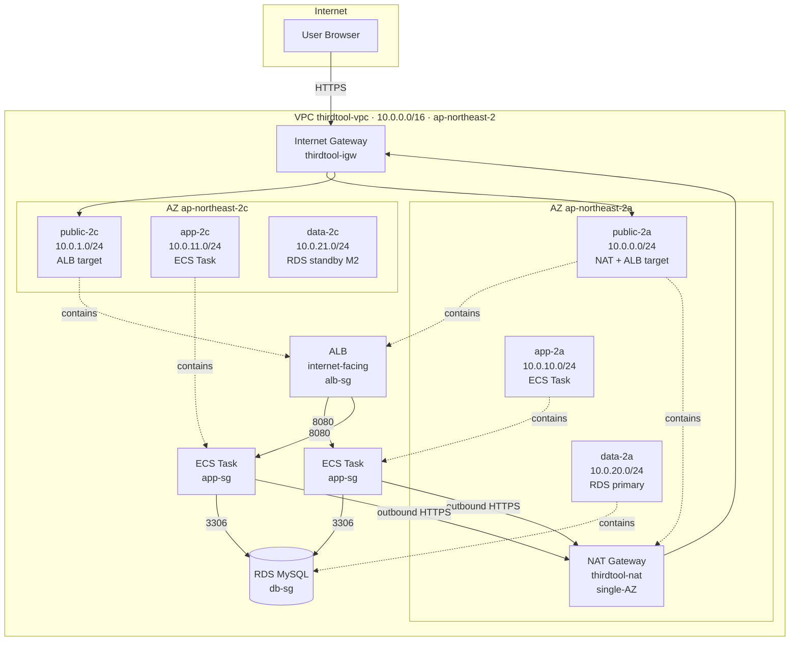

# VPC 토폴로지 (Story-048)

> ThirdTool AWS 네트워크 단일 진실 소스 다이어그램. 신규 합류자가 30초 안에 토폴로지·데이터 흐름·보안 경계를 파악할 수 있도록 작성.
>
> 코드 단일 진실 소스: `infra/vpc/vpc-spec.json` + `infra/vpc/security-groups.json`.
> 의사결정 배경: [ADR015](../adr/ADR015-vpc-3-layer-network-design.md).
> 셋업 절차: [ts009](../operations/troubleshooting/ts009-vpc-setup.md).

---

## 1. 토폴로지



---

## 2. Subnet 표

| subnet 이름 | CIDR | AZ | layer | route table | 용도 |
| --- | --- | --- | --- | --- | --- |
| `public-2a` | `10.0.0.0/24`  | ap-northeast-2a | public | public-rt  | ALB target + NAT Gateway |
| `public-2c` | `10.0.1.0/24`  | ap-northeast-2c | public | public-rt  | ALB target (multi-AZ) |
| `app-2a`    | `10.0.10.0/24` | ap-northeast-2a | app    | private-rt | ECS Fargate Task |
| `app-2c`    | `10.0.11.0/24` | ap-northeast-2c | app    | private-rt | ECS Fargate Task |
| `data-2a`   | `10.0.20.0/24` | ap-northeast-2a | data   | private-rt | RDS MySQL primary |
| `data-2c`   | `10.0.21.0/24` | ap-northeast-2c | data   | private-rt | RDS standby (M2 multi-AZ 시) |

각 /24 = 251 호스트 (AWS 예약 5개 차감). M1 트래픽에 충분.

---

## 3. 라우팅 표

| route table | 연결 subnet | 라우트 |
| --- | --- | --- |
| `public-rt`  | `public-2a`, `public-2c` | `0.0.0.0/0 → thirdtool-igw` |
| `private-rt` | `app-2a`, `app-2c`, `data-2a`, `data-2c` | `0.0.0.0/0 → thirdtool-nat` |

private subnet 4개 모두 동일 `private-rt` 사용 → 모든 private 트래픽이 `thirdtool-nat`(public-2a) 경유. **NAT 단일 장애점** — ADR015 결정 trade-off.

---

## 4. Security Group 규칙 표

| SG | inbound | outbound | 비고 |
| --- | --- | --- | --- |
| `alb-sg`         | `0.0.0.0/0 → 80, 443` | all | 인터넷 직접 노출 — 유일한 0.0.0.0/0 인바운드 |
| `app-sg`         | `alb-sg → 8080`       | all | ECS Task — ALB만 진입 허용, 외부는 NAT 경유 outbound |
| `db-sg`          | `app-sg → 3306`       | (none) | RDS — egress 없음. app-sg에서만 접근 가능 |
| `bastion-sg`     | (none)                | all | SSM Session Manager 의존 — SSH 인바운드 없음 |
| `vpc-endpoint-sg`| `app-sg → 443`        | (none) | M2 VPC Endpoint 도입 대비 |

**참조 체인**: `alb-sg → app-sg → db-sg` — 데이터 흐름과 정확히 일치. RDS는 ALB·인터넷 어디서도 직접 접근 불가.

---

## 5. 데이터 흐름

### 5.1 인바운드 (사용자 요청)

```
User → IGW → ALB(public-2{a,c}) → ECS Task(app-2{a,c}) → RDS(data-2a)
       │      [alb-sg]            [app-sg]                [db-sg]
       │      :80/:443            :8080                   :3306
```

### 5.2 아웃바운드 (ECS → 외부 API)

```
ECS Task(app-2{a,c}) → NAT(public-2a) → IGW → Internet
[app-sg egress all]    [thirdtool-nat]   [thirdtool-igw]
```

ECR pull · Secrets Manager · CloudWatch Logs · 외부 OAuth API(카카오/네이버) 등이 본 경로 사용.

### 5.3 운영 진입 (Bastion via SSM)

```
Operator AWS Console → SSM Session Manager → Bastion(any private subnet) → 내부 리소스
[no inbound SG rule, outbound SSM endpoints]
```

SSH 키 관리 불필요 — IAM 권한 기반.

---

## 6. M2 확장 후보

| 확장 | 영향 | 우선순위 |
| --- | --- | --- |
| Multi-AZ NAT Gateway (public-2c에 추가) | `private-rt`를 2a/2c용으로 분리. NAT 단일 장애점 제거 | 트래픽 발생 후 |
| VPC Interface Endpoint (s3·ecr·secretsmanager·logs 4종) | app-sg → vpc-endpoint-sg → AWS API 경유. NAT 데이터 전송 비용 절감 | NAT 비용 임계 도달 시 |
| VPC Flow Logs (CloudWatch Logs 송신) | 보안 감사·트래픽 분석. CloudWatch 저장 비용 발생 | 보안 사고 추적 필요 시 |
| Terraform IaC 모듈화 | 본 spec JSON을 모듈 입력으로 변환. drift 차단 | M2 Product 7 Epic 2 |
| staging 전용 VPC 분리 | 현재 shared. cross-environment 격리 필요 시 | 환경 분리 Epic |
| Network ACL 커스터마이즈 | default(allow all) 유지 중. layer 간 격리 강화 시 | 보안 감사 결과 |

---

## 7. 관련 자산

- `infra/vpc/vpc-spec.json` — VPC + subnet + IGW + NAT + route table 단일 진실 소스
- `infra/vpc/security-groups.json` — 5종 SG 정의 + creationOrder
- `infra/ecs/service-prod.json` — 본 Story 산출 subnet/SG ID로 placeholder 치환
- `infra/ecs/service-staging.json` — 동일
- [ADR015](../adr/ADR015-vpc-3-layer-network-design.md) — 설계 결정 배경
- [ts009](../operations/troubleshooting/ts009-vpc-setup.md) — AWS 콘솔/CLI 1회성 셋업 절차
